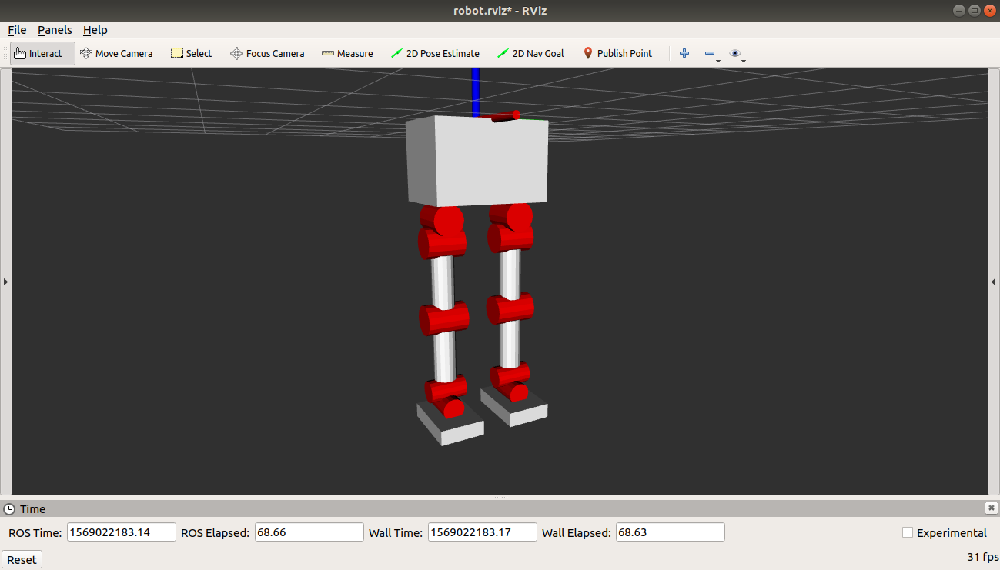

## ROS control of Robot Asimo E1

Package Name: asimo_e1_description 

## Quick Start

To launch robot in Gazebo: 
	
	roslaunch asimo_e1_description gazeboV2.launch

To run control of robot:

	rosrun asimo_control main.py 

## Robot display with Rviz 

[![Watch the video]](https://youtu.be/IKFGcrc6w74)

Created with ROS melodic 
